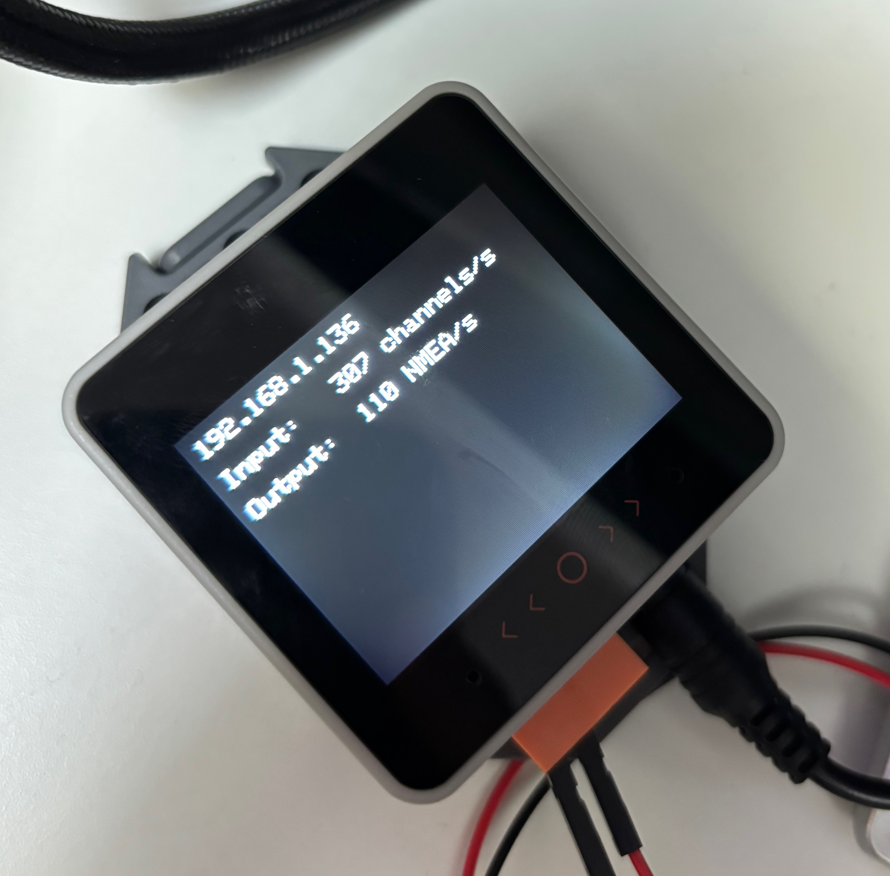

# fastnet2ip-esp
Implemented in C and designed to run on M5Stack Core S3 ESP-32 and the associated PWR CAN module. It connected to a Fastnet B&G network and collects raw data from the bus, it then converts them to NMEA messages and broadcasts over UDP. 

## Recommended Hardware
- [M5Stack Core S3](https://shop.m5stack.com/products/m5stack-cores3-se-iot-controller-w-o-battery-bottom) - don't forget seperate power supply required for this!!
- [M5Stack Power CAN Module](https://shop.m5stack.com/products/pwrcan-13-2-module-with-isolated-2-ch-can-1-ch-rs485)

## Instructions
- Configure UDP Port, SSID and password within the .ino file and then use the Arduino IDE to write to the Core S3 module.

## Images

